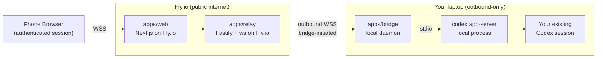

# Handoff

*Your local Codex session, handed off to your phone. No inbound ports. No cloud replacement. Just a handoff.*

[The Problem](#the-problem) · [The Solution](#the-solution) · [Features](#features) · [How It Works](#how-it-works) · [Tech Stack](#tech-stack) · [Status & Roadmap](#status--roadmap) · [About](#about)

---

> **Heads up.** Just Handoff is in active development. The product, protocol, and security model are specified under `.planning/` and being built phase by phase. This README is the contract I'm holding myself to. If that's exciting to you, star the repo and follow along. If you need something you can run today, check back in a few weeks.

---

## The Problem

You start a Codex session on your laptop. You step away for coffee, or lunch, or you just want to lie on the couch for twenty minutes. And Codex is mid-turn — asking for an approval you haven't given, waiting on a command you need to confirm, streaming output you'd love to keep an eye on but can't, because your laptop is across the room and the session is pinned to it.

Every existing way out of this has a tradeoff I'm not willing to make:

- **Opening an inbound port on your laptop** is a security posture you can't explain to yourself in one sentence, let alone defend. Router rules, dynamic DNS, TLS certificates you have to rotate — all for a convenience feature.
- **Moving your session into a cloud-hosted coding agent** means re-uploading everything your local environment already has. Your dotfiles, your auth tokens, the half-applied migration you haven't committed yet. You trust a third party with all of it, and you lose the thing that made your local setup yours.
- **Terminal-scraping tools** like SSH plus tmate or tmux over ngrok lose Codex's structured approvals, tool events, and sandbox semantics the instant they render bytes to a pseudo-terminal. You end up watching a log instead of driving a session.

None of those feel right. I wanted one that did.

## The Solution

**Just Handoff is a secure remote-control layer for your local Codex session, optimized for phone-sized browsers.**

You run a small local bridge next to Codex on your laptop. You scan a QR code the bridge prints in your terminal. Your phone opens the Fly.io-hosted web UI and picks up the same live session — approvals, tool calls, streamed assistant output, interrupts — all preserved. Your laptop never opens an inbound port. The cloud never sees your code. Codex's sandbox and approval semantics are preserved end to end.

It is intentionally *not* a cloud coding agent. It is a window into the local session you already have.

*Just a handoff. Nothing more.*

## Features

- **Secure pairing.** A QR code rendered directly in your terminal, a verification phrase shown on both sides of the handshake, single-use pairing tokens that expire in minutes, and 7-day device sessions after that.
- **Outbound-only local bridge.** The bridge talks outbound to the relay; your laptop never accepts an inbound connection. No router rules, no dynamic DNS, no firewall holes.
- **Real Codex integration.** Built on `codex app-server`, not PTY scraping. Structured thread, turn, and session events. Approvals preserved. Sandbox preserved.
- **Phone-first live UI.** Agent messages, tool activity, command execution, and approval state are rendered as distinct things on a phone-sized screen — not one undifferentiated log. Prompt, steer, interrupt, all from your pocket.
- **Device safety.** View and revoke paired devices. Reconnect after a dropped network without repeating the full pairing flow. Every pairing, approval, revoke, and disconnect gets an audit entry.
- **Fly.io-native relay.** Multi-instance ownership routing from day one, so the relay scales past a single box without the control plane turning into a single in-memory coordinator.
- **Open source and self-hostable.** v1 is designed to be forkable and contributor-friendly. No hidden control plane. No magic.

## How It Works

**The cloud layer owns auth, pairing, audit, and routing.** `apps/web` is the mobile-first Next.js surface you sign into and manage devices from. `apps/relay` is the Fastify plus `ws` control plane that routes live browser-to-bridge channels and holds the durable state in Postgres.

**The local bridge owns the Codex process boundary.** `apps/bridge` is a small daemon that talks outbound over WSS to the relay and locally over stdio to `codex app-server`. It normalizes Codex events into the product protocol shared by every component in the system (`packages/protocol`).

**Browsers never touch the local machine or raw Codex protocols directly.** Every live session flows browser to relay to bridge to Codex, validated at each hop, with short-lived connection credentials derived from a stronger authenticated device session.

## Tech Stack

The repo is a TypeScript monorepo. The layout is planned as:

| Package | Role |
|---|---|
| `apps/web` | Next.js 16 mobile-first web UI and authenticated session surface |
| `apps/relay` | Fastify plus `ws` control plane: auth APIs, relay routing, live channels |
| `apps/bridge` | Local daemon talking outbound to the relay and locally to `codex app-server` |
| `packages/protocol` | Shared event schema and control messages across web, relay, and bridge |
| `packages/auth` | Session, pairing, and token primitives (`zod`, `jose`, single-use tickets) |
| `packages/db` | Postgres plus Drizzle schema for users, devices, pairings, audit logs |
| `packages/ui` | Shared React components for the mobile web app |
| `packages/observability` | Metrics, logs, and tracing shared across services |

## Status & Roadmap

Just Handoff is being built in five phases, each one gated on the security and UX guarantees of the previous. There is no install section yet on purpose — I'd rather this README reflect reality than ship a copy-paste block I can't honor.

1. **Phase 1 — Identity & Pairing Foundation.** Secure sign-in, QR-based pairing with terminal confirmation, 7-day device sessions, and a Fly.io deployment baseline with TLS and health checks.
2. **Phase 2 — Bridge & Codex Session Adapter.** Local bridge daemon lifecycle, outbound relay registration, `codex app-server` integration, and remote attach-to-session that preserves conversation history and sandbox rules.
3. **Phase 3 — Live Remote UI & Control.** Phone-first session shell with structured activity rendering, live stream transport, prompt-steer-interrupt controls, and small-screen interaction polish.
4. **Phase 4 — Approval, Audit & Device Safety.** Device and session revocation, reconnect and resume after transient drops, approval-state surfaces, and a full audit trail for pairing, approval, revoke, and disconnect events.
5. **Phase 5 — Multi-Instance Routing & Production Hardening.** Relay ownership routing across multiple Fly.io instances, backpressure and queue guards, operator observability, and scale validation.

The full phase breakdown, requirement traceability, and success criteria live in [`.planning/ROADMAP.md`](./.planning/ROADMAP.md), [`.planning/REQUIREMENTS.md`](./.planning/REQUIREMENTS.md), and [`AGENTS.md`](./AGENTS.md).

## Contributing

The project is being built in the open using a spec-driven workflow, so every phase lives in `.planning/` before any code gets written. If you want to read the spec, argue with a decision, or follow the build, that is all public.

Issues and pull requests become useful once Phase 1 lands. Until then, the most helpful thing you can do is read `.planning/PROJECT.md` and tell me where my threat model is wrong.

## License

MIT.

## About

I'm Lakshman Turlapati. I wanted to keep working on my Codex sessions from the couch without ever shipping my environment to a cloud agent, and I couldn't find anything that did exactly that without making me trade away either security or the actual feel of a local session. So I'm building it.

More of what I make lives at [www.audienclature.com](https://www.audienclature.com).
