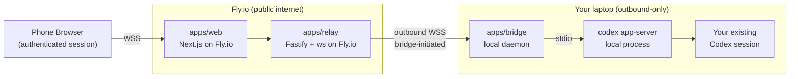

<div align="center">

# Handoff

*Your local Codex session, handed off to your phone. No inbound ports. No cloud replacement. Just a handoff.*


[The Problem](#the-problem) · [The Solution](#the-solution) · [Features](#features) · [How It Works](#how-it-works) · [Tech Stack](#tech-stack) · [Status & Roadmap](#status--roadmap) · [About](#about)

</div>

---

> **Heads up.** Just Handoff is in active development. The product, protocol, and security model are specified under `.planning/` and being built phase by phase. This README is the contract I'm holding myself to. If that's exciting to you, star the repo and follow along. If you need something you can run today, check back in a few weeks.

---

## The Problem

You start a Codex session on your laptop. You step away for coffee, or lunch, or you just want to lie on the couch for twenty minutes. And Codex is mid-turn — asking for an approval you haven't given, waiting on a command you need to confirm, streaming output you'd love to keep an eye on but can't, because your laptop is across the room and the session is pinned to it.

Every existing way out of this has a tradeoff I'm not willing to make:

- **Opening an inbound port on your laptop** is a security posture you can't explain to yourself in one sentence, let alone defend. Router rules, dynamic DNS, TLS certificates you have to rotate — all for a convenience feature.
- **Moving your session into a cloud-hosted coding agent** means re-uploading everything your local environment already has. Your dotfiles, your auth tokens, the half-applied migration you haven't committed yet. You trust a third party with all of it, and you lose the thing that made your local setup yours.
- **Terminal-scraping tools** like SSH plus tmate or tmux over ngrok lose Codex's structured approvals, tool events, and sandbox semantics the instant they render bytes to a pseudo-terminal. You end up watching a log instead of driving a session.

None of those feel right. I wanted one that did.

## The Solution

**Just Handoff is a secure remote-control layer for your local Codex session, optimized for phone-sized browsers.**

You run a small local bridge next to Codex on your laptop. You scan a QR code the bridge prints in your terminal. Your phone opens the Fly.io-hosted web UI and picks up the same live session — approvals, tool calls, streamed assistant output, interrupts — all preserved. Your laptop never opens an inbound port. The cloud never sees your code. Codex's sandbox and approval semantics are preserved end to end.

It is intentionally *not* a cloud coding agent. It is a window into the local session you already have.

*Just a handoff. Nothing more.*

## Features

- **Secure pairing.** A QR code rendered directly in your terminal, a verification phrase shown on both sides of the handshake, single-use pairing tokens that expire in minutes, and 7-day device sessions after that.
- **Outbound-only local bridge.** The bridge talks outbound to the relay; your laptop never accepts an inbound connection. No router rules, no dynamic DNS, no firewall holes.
- **Real Codex integration.** Built on `codex app-server`, not PTY scraping. Structured thread, turn, and session events. Approvals preserved. Sandbox preserved.
- **Phone-first live UI.** Agent messages, tool activity, command execution, and approval state are rendered as distinct things on a phone-sized screen — not one undifferentiated log. Prompt, steer, interrupt, all from your pocket.
- **Device safety.** View and revoke paired devices. Reconnect after a dropped network without repeating the full pairing flow. Every pairing, approval, revoke, and disconnect gets an audit entry.
- **Fly.io-native relay.** Multi-instance ownership routing from day one, so the relay scales past a single box without the control plane turning into a single in-memory coordinator.
- **Open source and self-hostable.** v1 is designed to be forkable and contributor-friendly. No hidden control plane. No magic.

## How It Works



**The cloud layer owns launch, pairing, audit, and routing.** `apps/web` is the mobile-first Next.js surface that consumes short-lived handoff URLs, manages trusted devices, and lands the phone on the active local session. `apps/relay` is the Fastify plus `ws` control plane that routes live browser-to-bridge channels and holds the durable state in Postgres.

**The local bridge owns the Codex process boundary.** `apps/bridge` is a small daemon that talks outbound over WSS to the relay and locally over stdio to `codex app-server`. It normalizes Codex events into the product protocol shared by every component in the system (`packages/protocol`).

**Browsers never touch the local machine or raw Codex protocols directly.** Every live session flows browser to relay to bridge to Codex, validated at each hop, with short-lived connection credentials derived from a stronger authenticated device session.

## Tech Stack

<div align="center">


</div>

The repo is a TypeScript monorepo. The layout is planned as:

| Package | Role |
|---|---|
| `apps/web` | Next.js 16 mobile-first web UI and authenticated session surface |
| `apps/relay` | Fastify plus `ws` control plane: auth APIs, relay routing, live channels |
| `apps/bridge` | Local daemon talking outbound to the relay and locally to `codex app-server` |
| `packages/protocol` | Shared event schema and control messages across web, relay, and bridge |
| `packages/auth` | Session, pairing, and token primitives (`zod`, `jose`, single-use tickets) |
| `packages/db` | Postgres plus Drizzle schema for users, devices, pairings, audit logs |
| `packages/ui` | Shared React components for the mobile web app |
| `packages/observability` | Metrics, logs, and tracing shared across services |

## Status & Roadmap

Just Handoff is being built in five phases, each one gated on the security and UX guarantees of the previous. There is no install section yet on purpose — I'd rather this README reflect reality than ship a copy-paste block I can't honor.

1. **Phase 1 — Identity & Pairing Foundation.** Secure sign-in, QR-based pairing with terminal confirmation, 7-day device sessions, and a Fly.io deployment baseline with TLS and health checks.
2. **Phase 2 — Bridge & Codex Session Adapter.** Local bridge daemon lifecycle, outbound relay registration, `codex app-server` integration, and remote attach-to-session that preserves conversation history and sandbox rules.
3. **Phase 3 — Live Remote UI & Control.** Phone-first session shell with structured activity rendering, live stream transport, prompt-steer-interrupt controls, and small-screen interaction polish.
4. **Phase 4 — Approval, Audit & Device Safety.** Device and session revocation, reconnect and resume after transient drops, approval-state surfaces, and a full audit trail for pairing, approval, revoke, and disconnect events.
5. **Phase 5 — Multi-Instance Routing & Production Hardening.** Relay ownership routing across multiple Fly.io instances, backpressure and queue guards, operator observability, and scale validation.

The full phase breakdown, requirement traceability, and success criteria live in [`.planning/ROADMAP.md`](./.planning/ROADMAP.md), [`.planning/REQUIREMENTS.md`](./.planning/REQUIREMENTS.md), and [`AGENTS.md`](./AGENTS.md).

---

> The sections below are the operator contract for Phase 1. They describe how to run the web app, relay, and bridge locally, how to configure authentication, how the pairing handshake works, and how to deploy the public services to Fly.io. If something in this section drifts from the code, the code wins and this README needs a follow-up edit.

## Local Development

Handoff is an npm workspaces monorepo. Everything under `apps/` and `packages/` is installed in a single top-level `npm ci`, and Phase 1 only needs Node.js 22 and a reachable Postgres instance.

### Prerequisites

- **Node.js 22 or newer.** The repo declares `"engines": { "node": ">=22.0.0" }` and the Dockerfiles pin `node:22-alpine`. Older versions will fail `npm ci`.
- **npm 10 or newer.** Comes with Node 22. The repo pins `"packageManager": "npm@10.9.3"` so other package managers are not supported.
- **A Postgres database** reachable from the web app and the relay. For local development this is usually a single `postgres://` URL pointing at Docker, Fly Postgres, or a shared dev instance.
- **A GitHub OAuth application (optional)** — only needed if you still use the legacy `/pair/<pairingId>` bootstrap pairing path. The active `/launch/<publicId>` handoff flow does not require secondary OAuth.

### Installing and building

```bash
# Install every workspace and hoist root dev deps (vitest, playwright, drizzle-kit, typescript).
npm ci

# Type-check every workspace that has a typecheck script.
npm run typecheck

# Run the Phase 1 quick suite (unit tests only, no Playwright).
npm run test:phase-01:quick

# Run the Phase 1 full suite (unit tests + mobile e2e smoke).
npm run test:phase-01:full
```

The repo uses TypeScript path aliases declared in [`tsconfig.base.json`](./tsconfig.base.json) so the apps can import `@codex-mobile/{protocol,auth,db}` directly from source in development. Production Docker images rebuild those packages with `tsc` inside the build stage.

### Running the services locally

Each app is runnable as its own npm workspace. Run them in separate terminals so you can watch each log stream:

```bash
# apps/web -- Next.js 16 on http://localhost:3000
npm run dev --workspace @codex-mobile/web

# apps/relay -- Fastify + ws on http://localhost:8080
npm run dev --workspace @codex-mobile/relay

# apps/bridge -- local CLI daemon (only needed once you are pairing a device)
npm run dev --workspace @codex-mobile/handoff
```

Health endpoints are served by the first two:

- **Web app liveness:** `GET http://localhost:3000/api/healthz` returns `{"status":"ok","service":"codex-mobile-web",...}`.
- **Relay liveness:** `GET http://localhost:8080/healthz` returns `{"status":"ok","service":"codex-mobile-relay",...}`.
- **Relay readiness:** `GET http://localhost:8080/readyz` returns `{"status":"ready","service":"codex-mobile-relay",...}`. Phase 1 treats this as identical to liveness; Plan 02-01 will make it ownership-aware once bridges start connecting.

### Environment variables

Copy `.env.example` to `.env.local` at the repo root (Next.js will pick it up automatically) and fill in real values. Every key documented in `.env.example` is required for the web app and relay to boot with correct auth:

| Key | Who uses it | Notes |
| --- | --- | --- |
| `DATABASE_URL` | apps/web, apps/relay, packages/db | Shared Postgres connection string. Attach the same database to both Fly apps. |
| `AUTH_GITHUB_ID` | apps/web | Optional. GitHub OAuth app Client ID for the legacy `/pair/<pairingId>` bootstrap flow. |
| `AUTH_GITHUB_SECRET` | apps/web | Optional. GitHub OAuth app Client Secret for the legacy `/pair/<pairingId>` bootstrap flow. |
| `NEXTAUTH_URL` | apps/web | Absolute URL the web app is reachable at (e.g. `https://app.example.com`). Used for Auth.js callbacks. |
| `AUTH_SECRET` | apps/web | Optional. 32+ byte Auth.js signing secret for the legacy bootstrap sign-in flow. |
| `SESSION_COOKIE_SECRET` | apps/web, apps/relay | 32+ byte random signing key for `cm_web_session` and `cm_device_session` cookies. |
| `PAIRING_TOKEN_SECRET` | apps/web | 32+ byte signing key for single-use pairing tokens minted by `POST /api/pairings`. |
| `WS_TICKET_SECRET` | apps/web, apps/relay | 32+ byte signing key for short-lived `cm_ws_ticket` WebSocket upgrade tickets. MUST be distinct from `SESSION_COOKIE_SECRET`. |
| `FLY_APP_NAME_WEB` | deploys | Fly app slug used by `apps/web/fly.toml`. |
| `FLY_APP_NAME_RELAY` | deploys, apps/web | Fly app slug used by `apps/relay/fly.toml` and injected into the web runtime so it can derive relay URLs on Fly. |

The four random secrets (`AUTH_SECRET`, `SESSION_COOKIE_SECRET`, `PAIRING_TOKEN_SECRET`, `WS_TICKET_SECRET`) should be generated independently. Compromising one must not let an attacker replay it as another. Generate each one with `openssl rand -base64 48` or equivalent.

## Hosted Handoff Launch

The active `/handoff` flow is now URL-native:

1. Codex runs `/handoff` from the active thread and the local helper mints a short-lived hosted `/launch/<publicId>` URL.
2. Opening that URL on the phone does **not** redirect through GitHub OAuth.
3. The hosted app validates the handoff, establishes or reuses the durable `cm_device_session`, and redirects the browser straight to `/session/<sessionId>`.
4. Once the durable device session exists, the root, device-management, and live-session pages all authenticate from that cookie instead of a separate `cm_web_session`.

## Legacy Bootstrap Sign-In

Auth.js plus GitHub OAuth still exist only for the older bootstrap pairing path. If you are debugging or using `/pair/<pairingId>` directly, the sign-in flow is:

1. The user visits any authenticated path on the web app.
2. Middleware redirects them to `/sign-in?callbackUrl=<original-path>`.
3. They click **Continue with GitHub** and complete the OAuth handshake.
4. Auth.js writes a short-lived `cm_web_session` cookie (12-hour rolling JWT).
5. The user returns to their original path (typically `/pair/<pairingId>`).

### Creating the GitHub OAuth app

1. In your GitHub account, go to **Settings -> Developer settings -> OAuth Apps -> New OAuth App**.
2. Set **Homepage URL** to your public web origin (for example `https://app.example.com` for Fly.io or `http://localhost:3000` locally).
3. Set **Authorization callback URL** to `${NEXTAUTH_URL}/api/auth/callback/github`. For example:
   - Locally: `http://localhost:3000/api/auth/callback/github`
   - On Fly.io: `https://app.example.com/api/auth/callback/github`
4. Click **Register application**, then copy the **Client ID** into `AUTH_GITHUB_ID` and generate a **Client Secret** into `AUTH_GITHUB_SECRET`.
5. Restart the web app so Auth.js picks up the new env vars.

### Database migration

Before the first sign-in, apply the Drizzle schema to your Postgres instance:

```bash
npm run db:generate
```

This emits SQL migration files from `packages/db/src/schema.ts`. Apply them with your preferred Postgres migration tool, or use `drizzle-kit push --config packages/db/drizzle.config.ts` for a fast local dev loop. Plan 01-03 does not automate production migrations — operators run them out-of-band before deploy.

## Pairing Flow

This section describes the legacy bootstrap pairing path used by the dedicated bridge `pair` command. The active `/handoff` launch path above no longer requires this secondary sign-in flow.

Pairing is how a phone browser proves it is allowed to remote-control a local Codex session. Phase 1 implements the full handshake without any inbound port on the developer machine.

The end-to-end flow is:

1. On the laptop, the operator runs the bridge CLI pair command (or any entry point that invokes `runPairCommand`).
2. The bridge calls `POST /api/pairings` on the web app, receives `{ pairingId, pairingUrl, userCode, expiresAt }`, and prints a QR code plus the fallback `userCode` to the terminal using `renderTerminalQr`.
3. The operator scans the QR with their phone. The phone browser opens `${NEXTAUTH_URL}/pair/<pairingId>`.
4. If the phone is not already signed in, middleware redirects to `/sign-in?callbackUrl=/pair/<pairingId>`. After GitHub OAuth completes, the phone lands back on the pairing screen.
5. The phone calls `POST /api/pairings/<pairingId>/redeem`, which moves the pairing from `pending` to `redeemed` and generates a three-word `verificationPhrase`.
6. The browser and the terminal both render the same `verificationPhrase`. The operator confirms they match and answers `y` in the terminal.
7. The bridge calls `POST /api/pairings/<pairingId>/confirm`, which performs a constant-time phrase comparison, writes an audit row, transitions the pairing to `confirmed`, and issues a `cm_device_session` cookie (7-day absolute expiry) on the phone.
8. Any subsequent terminal-less pairing attempt with the same `pairingId` is rejected because the row is terminal.

Pairing tokens are single-use and expire five minutes after creation (`PAIRING_TTL_SECONDS = 300`). A failed phrase comparison writes a `pairing.confirm_failed` audit row but does NOT issue a device session.

**Verification endpoints to use while debugging:**

- `curl -i http://localhost:3000/api/healthz` — confirms the web app is serving.
- `curl -i http://localhost:8080/readyz` — confirms the relay is serving.
- `curl -i http://localhost:3000/sign-in` — unauthenticated should land on the Auth.js sign-in page, not a redirect loop.

The bridge is **outbound connectivity only**. It never opens an inbound port on the developer laptop. The relay is a hosted service on Fly.io, not a tunnel for general shell access — its sole job in Phase 2 will be to route Codex app-server events between an authenticated phone browser and the local bridge, and it refuses any traffic that cannot produce a short-lived `cm_ws_ticket`.

## Fly.io Deployment

Handoff's public services run on Fly.io. Phase 1 ships two separate Fly apps:

| Fly app (slug) | Source | Fly config | Internal port | Fly health check path |
| --- | --- | --- | --- | --- |
| `${FLY_APP_NAME_WEB}` (example: `handoff-web`) | `apps/web` | [`apps/web/fly.toml`](./apps/web/fly.toml) | 3000 | `/api/healthz` |
| `${FLY_APP_NAME_RELAY}` (example: `handoff-relay`) | `apps/relay` | [`apps/relay/fly.toml`](./apps/relay/fly.toml) | 8080 | `/readyz` (HTTP service) plus `/healthz` (machine liveness) |

Both services are built with multi-stage `node:22-alpine` Dockerfiles that `COPY` the repo root as the build context so the npm workspaces layout stays intact inside the image. The build context is set implicitly by `fly.toml` because the `dockerfile = "apps/<service>/Dockerfile"` path is relative to the repo root.

### IMPORTANT: Single-machine pairing store constraint (Phase 1)

Phase 1 ships with an **in-memory pairing store** (`apps/web/lib/pairing-service.ts` `InMemoryPairingStore`) for the `pairing_sessions` state machine. A pairing created on machine A is NOT visible to machine B, so `apps/web` **must run on exactly one Fly machine** until a Drizzle-backed store lands in a later phase.

Required Fly configuration until the Drizzle-backed adapter ships:

- `apps/web/fly.toml`: keep `min_machines_running = 1` under `[http_service]` so Fly never scales the pairing store down to zero.
- `apps/web/fly.toml`: keep `auto_start_machines` as-is (`true` is acceptable because only ONE machine will ever run).
- `apps/relay/fly.toml`: already sets `min_machines_running = 1` and `auto_start_machines = false`. No change needed.

Symptom if this constraint is violated: the bridge CLI creates a pairing on machine A, the browser redeems it against machine B, and machine B returns `pairing_not_found` because its process-local Map has never seen the row. Operators will see confused "pairing disappeared" errors.

This constraint is also why the in-memory rate limiter at `apps/web/lib/rate-limit.ts` is per-machine only; a multi-machine deploy needs a Redis-backed counter before scaling horizontally. Track both under the Phase 1 follow-ups.

### Prerequisites

- A Fly.io organization and an account logged in via `fly auth login`.
- Two Fly apps created (`fly apps create <slug>` for web and relay). Export the slugs as `FLY_APP_NAME_WEB` and `FLY_APP_NAME_RELAY`. The CI workflow passes them via `flyctl --app`, so the checked-in `app = "..."` lines in each `fly.toml` can stay generic.
- A shared Fly Managed Postgres cluster. Create it with `fly mpg create`, then attach it to both apps with `fly mpg attach <cluster> --app <slug>`. The attach command injects `DATABASE_URL` as a Fly secret for the target app.
- A personal access token from the Fly dashboard under **Personal Access Tokens**. Store it as the `FLY_API_TOKEN` GitHub Actions secret (see below).

### Secrets to push before first deploy

On both Fly apps (or via the GitHub Actions workflow below), set:

```bash
# Web app
fly secrets set \
  --app ${FLY_APP_NAME_WEB} \
  AUTH_GITHUB_ID=... \
  AUTH_GITHUB_SECRET=... \
  AUTH_SECRET=... \
  SESSION_COOKIE_SECRET=... \
  PAIRING_TOKEN_SECRET=... \
  WS_TICKET_SECRET=... \
  FLY_APP_NAME_RELAY=${FLY_APP_NAME_RELAY} \
  NEXTAUTH_URL=https://handoff-web.fly.dev

# Relay
fly secrets set \
  --app ${FLY_APP_NAME_RELAY} \
  SESSION_COOKIE_SECRET=... \
  WS_TICKET_SECRET=...
```

`DATABASE_URL` is expected to be set automatically by `fly mpg attach` on both apps.

### Deploying manually

```bash
# Web app
fly deploy \
  --app ${FLY_APP_NAME_WEB} \
  --config apps/web/fly.toml \
  --dockerfile apps/web/Dockerfile \
  --remote-only

# Relay
fly deploy \
  --app ${FLY_APP_NAME_RELAY} \
  --config apps/relay/fly.toml \
  --dockerfile apps/relay/Dockerfile \
  --remote-only
```

`--remote-only` uses Fly's build machines so no local Docker daemon is required. Deployment order does not matter for Phase 1 (the two services are independent), but by convention web is deployed first because it owns the pairing API.

### Deploying from CI

The repo ships [`.github/workflows/fly-deploy.yml`](./.github/workflows/fly-deploy.yml), which deploys both services from `main`. It runs on every push that touches `apps/web/**`, `apps/relay/**`, `packages/**`, or the workflow file itself, and it can also be triggered manually via **Actions -> fly-deploy -> Run workflow**.

Required GitHub Actions secrets (set under **Settings -> Secrets and variables -> Actions**):

- `FLY_API_TOKEN`
- `AUTH_GITHUB_ID`
- `AUTH_GITHUB_SECRET`
- `AUTH_SECRET`
- `SESSION_COOKIE_SECRET`
- `PAIRING_TOKEN_SECRET`
- `WS_TICKET_SECRET`
- `DATABASE_URL`

Required GitHub Actions variables:

- `FLY_APP_NAME_WEB`
- `FLY_APP_NAME_RELAY`
- `NEXTAUTH_URL`

The workflow stages secrets via `flyctl secrets set --stage` before each deploy so the rolling release uses the new values on the first machine.

### Security posture on Fly.io

- TLS is terminated at the Fly edge (`force_https = true` in both fly.toml files). Both services refuse plaintext connections.
- The local developer machine uses **outbound connectivity only**. The bridge talks outbound to the relay over WSS; no inbound port is ever opened on the laptop. This is the product's load-bearing security invariant.
- The relay is a hosted service, not a tunnel for general shell access. It only routes pre-authenticated Codex app-server traffic between a paired phone and a bridge whose ownership has been verified by the control plane.
- Phase 1 does not expose the `codex app-server` process directly to the internet, and no code path in this repo is allowed to. See [`docs/adr/0001-phase-1-trust-boundary.md`](./docs/adr/0001-phase-1-trust-boundary.md) for the binding trust-boundary rules.

### Verifying a deploy

Once both services are deployed, hit the health endpoints from anywhere on the public internet:

```bash
curl -i https://handoff-web.fly.dev/api/healthz
curl -i https://<your-relay-domain>/healthz
curl -i https://<your-relay-domain>/readyz
```

All three should return HTTP 200 with a JSON body containing `status` and `service`. Fly's deploy will mark the release healthy only after its own probes succeed against these same paths.

---

## Contributing

The project is being built in the open using a spec-driven workflow, so every phase lives in `.planning/` before any code gets written. If you want to read the spec, argue with a decision, or follow the build, that is all public.

Issues and pull requests become useful once Phase 1 lands. Until then, the most helpful thing you can do is read `.planning/PROJECT.md` and tell me where my threat model is wrong.

## License

MIT.

## About

I'm Lakshman Turlapati. I wanted to keep working on my Codex sessions from the couch without ever shipping my environment to a cloud agent, and I couldn't find anything that did exactly that without making me trade away either security or the actual feel of a local session. So I'm building it.

More of what I make lives at [www.audienclature.com](https://www.audienclature.com).
